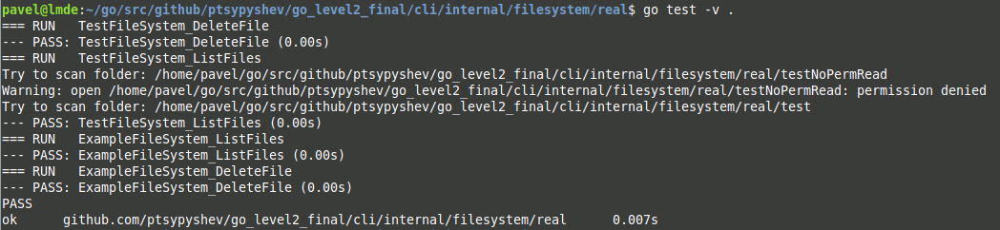

# Финальное ДЗ по курсу "Go. Уровень 2"

Для реализации функционала были затронуты только необходимые файлы из скелета проекта.  
Реализация -fs mock, а также ошибок осталась неизменной.  
Тесты написаны для обеих функция пакета real.  

Приложение получилось кросс-платформенное, успешно работает на linux и windows.
Удаление файлов реализовано в многопоточном режиме.

В проекте приложен скриншот с тестами (img/test_screenshot.png):  

